## 作业：

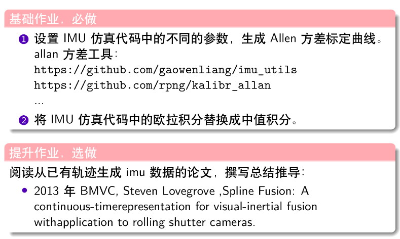

## *1，基础作业：*

(1)Allen方差标定曲线：

a.第一组参数：

|          参数          | 设定值  | kalibr-Allan标定结果 |                             单位                             |
| :--------------------: | :-----: | :------------------: | :----------------------------------------------------------: |
|   White Noise(gyro)    |  1e-02  |       1.01e-02       | 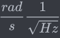 |
| Bias Instability(gyro) |  7e-03  |      7.044e-03       | 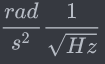 |
|    White Noise(acc)    | 1.2e-02 |      1.216e-02       | 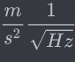 |
| Bias Instability(acc)  |  8e-03  |      6.675e-03       | 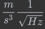 |

陀螺仪的Allan方差曲线如下图：

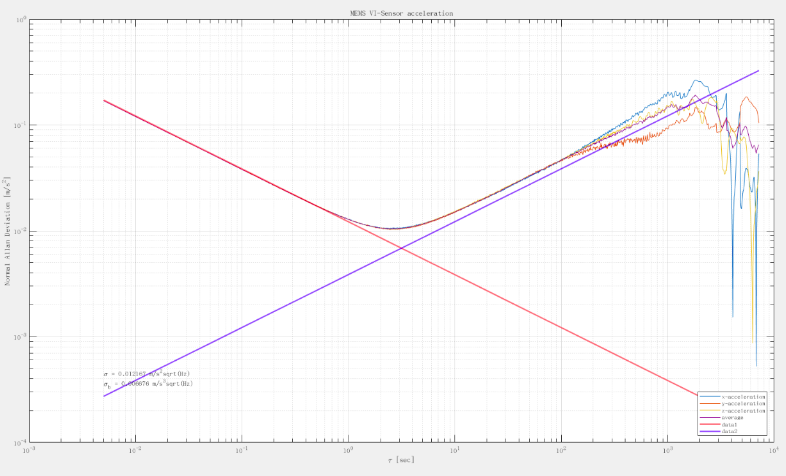

加速度计的Allan方差曲线如下图：

由Allan方差分析结果可得，陀螺仪和加速度计的白噪声和零偏不稳定性噪声估计值与实际设定的值相差不大。

b.第二组参数：

|          参数          | 设定值  | kalibr-Allan标定结果 |                             单位                             |
| :--------------------: | :-----: | :------------------: | :----------------------------------------------------------: |
|   White Noise(gyro)    | 1.5e-04 |      1.517e-04       | 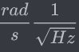 |
| Bias Instability(gyro) |  7e-06  |       6.25e-06       | 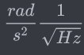 |
|    White Noise(acc)    | 1.9e-04 |      1.928e-04       | 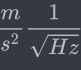 |
| Bias Instability(acc)  |  7e-06  |       7.54e-06       | 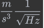 |

陀螺仪的Allan方差曲线如下图：

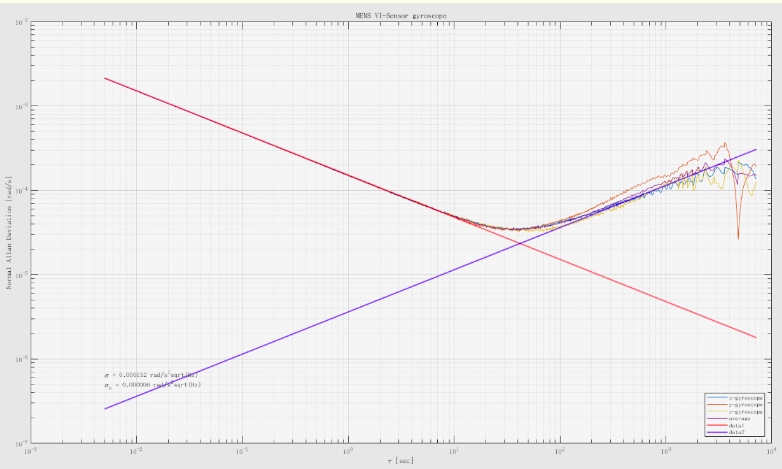

加速度计的Allan方差曲线如下图：

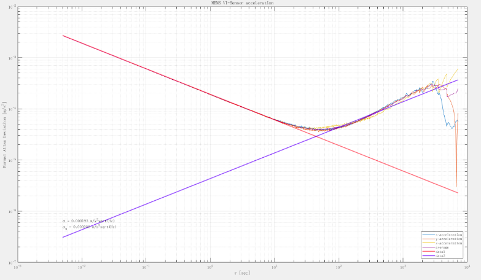

由第二组参数可知，提高了陀螺仪和加速度计的精度，陀螺仪和加速度计的白噪声估计精度相对较高，零偏不稳定性噪声估计值和实际设定值有一些差别。

（2）在IMU仿真代码中，使用中值积分替换欧拉积分:

*a.欧拉法：*

使用欧拉法，即两个相邻时刻k到k+1的位姿是用第k时刻的测量值a,w来计算：

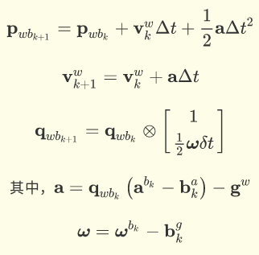

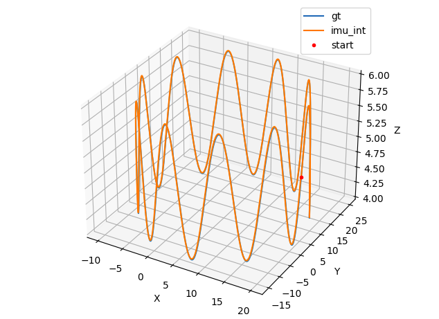

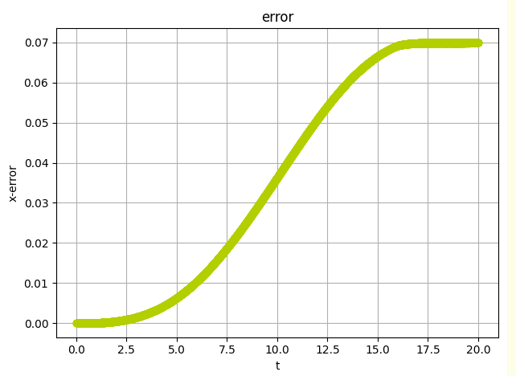

*b.中值法：*

这里考虑使用中值法来代替欧拉法，实际上k+1时刻的陀螺仪和加速计的测量值未知，所以考虑用k-1时刻和k时刻的陀螺仪和加速度计测量值的平均值来计算。

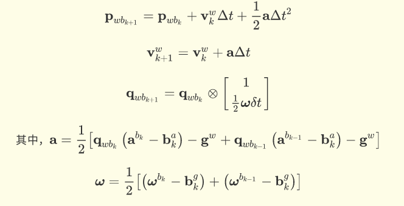

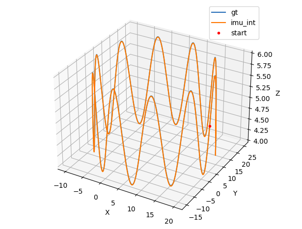

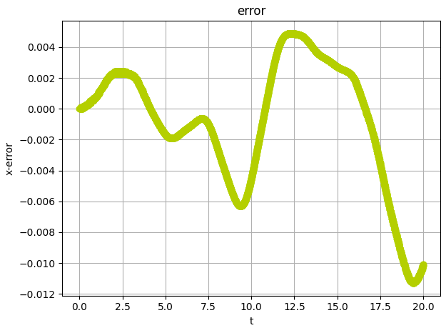

结果分析：

| 轴向 | 中值法和ground truth比较（绝对值） | 欧拉法和ground truth比较（绝对值） |
| :--: | :--------------------------------: | :--------------------------------: |
|  x   |        mean error: 0.00077         |        mean error: 0.35985         |
|  y   |         mean error:0.0107          |         mean error:0.00108         |
|  z   |          mean error:0.007          |         mean error:0.01499         |
| AVG  |             6.156e-03              |             1.253e-01              |

可见，中值法对于定位精度有明显提升。