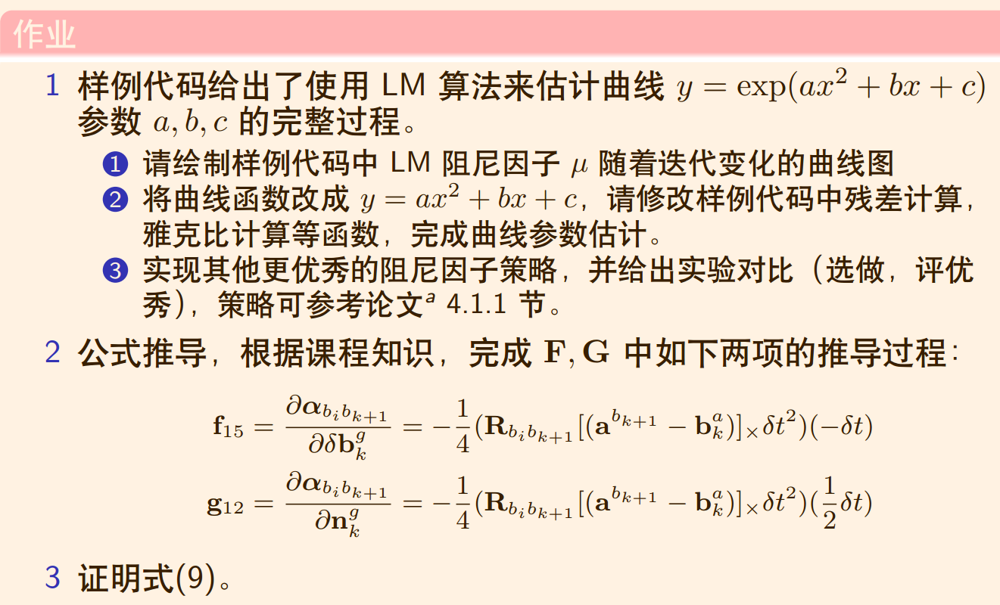
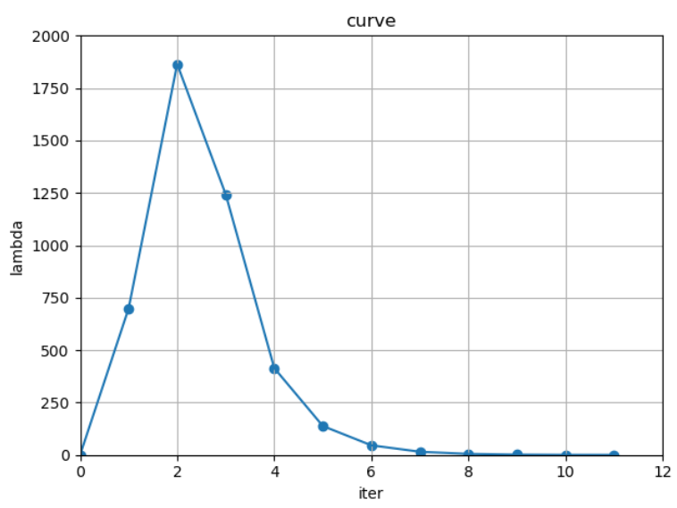
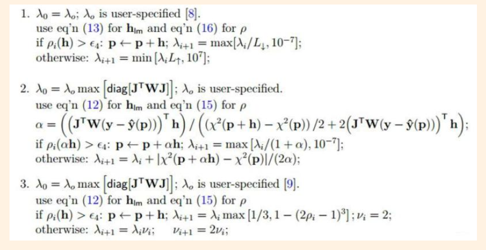
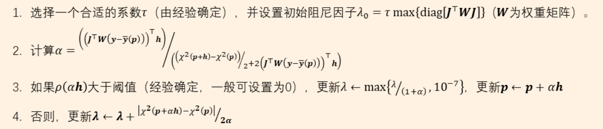
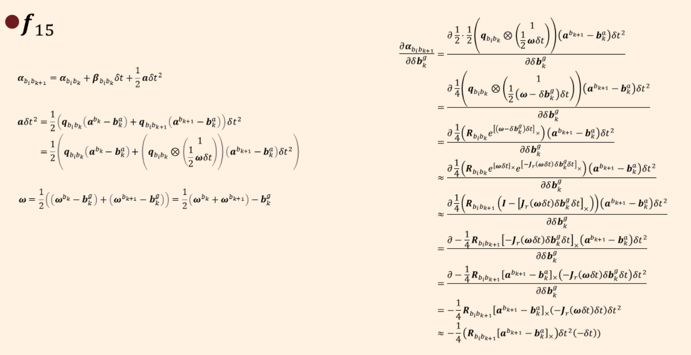
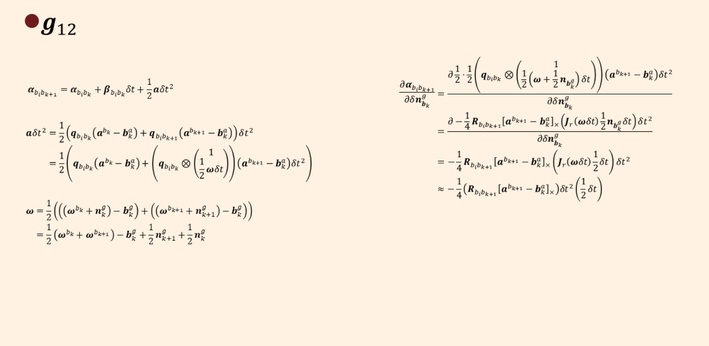
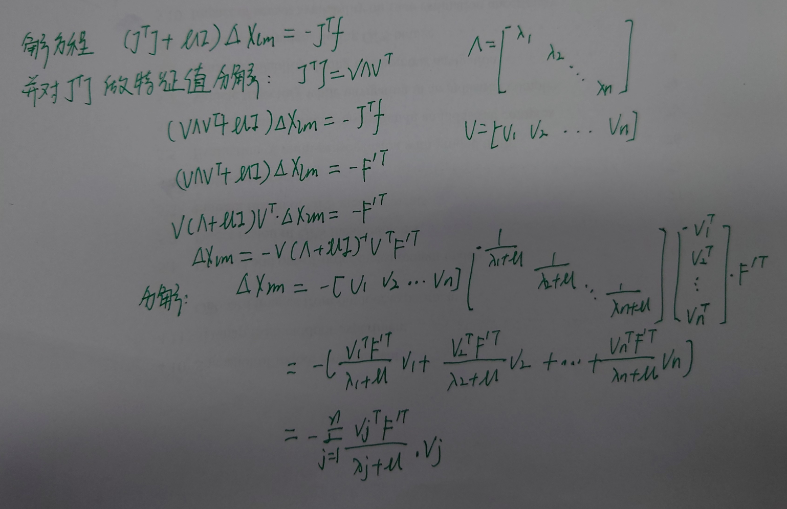

## 作业：



### 1，

#### 1.1 


$$
LM阻尼因子\mu随着迭代变化的曲线图
$$

#### 1.2

| param | optimization params | ground truth |
| :---- | ------------------- | ------------ |
| a     | 0.941939            | 1            |
| b     | 2.09453             | 2            |
| c     | 0.965586            | 1            |

运行结果：

```bash
/home/sjl/GNC/GIT/Shenlan-VIO/ch3/homework/LM/cmake-build-debug/app/testCurveFitting

Test CurveFitting start...
iter: 0 , chi= 36048.3 , Lambda= 0.001
iter: 1 , chi= 30015.5 , Lambda= 699.051
iter: 2 , chi= 13421.2 , Lambda= 1864.14
iter: 3 , chi= 7273.96 , Lambda= 1242.76
iter: 4 , chi= 269.255 , Lambda= 414.252
iter: 5 , chi= 105.473 , Lambda= 138.084
iter: 6 , chi= 100.845 , Lambda= 46.028
iter: 7 , chi= 95.9439 , Lambda= 15.3427
iter: 8 , chi= 92.3017 , Lambda= 5.11423
iter: 9 , chi= 91.442 , Lambda= 1.70474
iter: 10 , chi= 91.3963 , Lambda= 0.568247
iter: 11 , chi= 91.3959 , Lambda= 0.378832
problem solve cost: 13.9509 ms
   makeHessian cost: 9.68848 ms
-------After optimization, we got these parameters :
0.941939  2.09453 0.965586
-------ground truth: 
1.0,  2.0,  1.0

Process finished with exit code 0

```

#### 1.3

论文中有三种阻尼因子更新策略：



这里选择第二种，策略摘要：



被修改的代码模块;

```c++
bool Problem::IsGoodStepInLM() {
    ///double scale = 0;
    ///scale = delta_x_.transpose() * (currentLambda_ * delta_x_ + b_);
    ///scale += 1e-3;    // make sure it's non-zero :)

    // recompute residuals after update state
    // 统计所有的残差
    double tempChi = 0.0;
    for (auto edge: edges_) {
        edge.second->ComputeResidual();
        tempChi += edge.second->Chi2();
    }

    double Numerator = b_.transpose()*delta_x_;
    double alpha = Numerator / ((currentChi_ - tempChi)/2. + 2.*Numerator);
    alpha = std::max(alpha, 1e-1);

    RollbackStates();
    delta_x_ *=alpha;
    UpdateStates();

    tempChi = 0.0;
    for(auto edge: edges_){
        edge.second->ComputeResidual();
        tempChi += edge.second->Chi2();
    }

    double scale = 0;
    scale = delta_x_.transpose() * ( currentLambda_ * delta_x_ + b_);
    scale += 1e-3;
    double rho = (currentChi_ - tempChi) / scale;

    if(rho > 0 && isfinite(tempChi))
    {
        currentLambda_ = std::max(currentLambda_ / (1.+alpha), 1e-7);
        currentChi_ = tempChi;
        return true;
    } else {
        currentLambda_ += abs(currentChi_ - tempChi)/(2.*alpha);
        return false;
    }
}
```


```c++
void Problem::AddLambdatoHessianLM() {
    ulong size = Hessian_.cols();
    assert(Hessian_.rows() == Hessian_.cols() && "Hessian is not square");
    for (ulong i = 0; i < size; ++i) {
        Hessian_(i, i) *= (1. + currentLambda_);
    }
}
```


```c++
void Problem::RemoveLambdaHessianLM() {
    ulong size = Hessian_.cols();
    assert(Hessian_.rows() == Hessian_.cols() && "Hessian is not square");
    // TODO:: 这里不应该减去一个，数值的反复加减容易造成数值精度出问题？而应该保存叠加lambda前的值，在这里直接赋值
    for (ulong i = 0; i < size; ++i) {
        Hessian_(i, i) /= (1. + currentLambda_);
    }
}
```

策略2结果：

```bash
/home/sjl/GNC/GIT/Shenlan-VIO/ch3/homework/LM/cmake-build-debug/app/testCurveFitting

Test CurveFitting start...
iter: 0 , chi= 36048.3 , Lambda= 0.001
iter: 1 , chi= 8104.91 , Lambda= 0.000909091
iter: 2 , chi= 2143.22 , Lambda= 0.000597972
iter: 3 , chi= 1105.99 , Lambda= 0.000431416
iter: 4 , chi= 577.53 , Lambda= 0.000311052
iter: 5 , chi= 317.055 , Lambda= 0.000224024
iter: 6 , chi= 192.994 , Lambda= 0.000161178
iter: 7 , chi= 135.759 , Lambda= 0.000115849
iter: 8 , chi= 110.185 , Lambda= 8.31896e-05
iter: 9 , chi= 99.1242 , Lambda= 5.96831e-05
iter: 10 , chi= 94.4909 , Lambda= 4.27827e-05
iter: 11 , chi= 92.6071 , Lambda= 3.06453e-05
iter: 12 , chi= 91.861 , Lambda= 2.19376e-05
iter: 13 , chi= 91.5718 , Lambda= 1.56963e-05
iter: 14 , chi= 91.4617 , Lambda= 1.12264e-05
iter: 15 , chi= 91.4203 , Lambda= 8.02702e-06
iter: 16 , chi= 91.4049 , Lambda= 5.73818e-06
iter: 17 , chi= 91.3992 , Lambda= 4.10133e-06
iter: 18 , chi= 91.3971 , Lambda= 2.93107e-06
iter: 19 , chi= 91.3963 , Lambda= 2.09455e-06
iter: 20 , chi= 91.396 , Lambda= 1.49668e-06
iter: 21 , chi= 91.3959 , Lambda= 1.06942e-06
iter: 22 , chi= 91.3959 , Lambda= 7.64113e-07
iter: 23 , chi= 91.3959 , Lambda= 5.45955e-07
problem solve cost: 29.5429 ms
   makeHessian cost: 19.5352 ms
-------After optimization, we got these parameters :
0.942197  2.09419 0.965684
-------ground truth: 
1.0,  2.0,  1.0

Process finished with exit code 0
```

策略2并没有提高精度值，反而结算时间变长。

### 2

完成了F和G如下两项公式推导：
$$
\begin{aligned}
\mathbf{f}_{15} &=\frac{\partial \boldsymbol{\alpha}_{b_{i} b_{k+1}}}{\partial \delta \mathbf{b}_{k}^{g}}=-\frac{1}{4}\left(\mathbf{R}_{b_{i} b_{k+1}}\left[\left(\mathbf{a}^{b_{k+1}}-\mathbf{b}_{k}^{a}\right)\right]_{\times} \delta t^{2}\right)(-\delta t) \\
\mathbf{g}_{12} &=\frac{\partial \boldsymbol{\alpha}_{b_{i} b_{k+1}}}{\partial \mathbf{n}_{k}^{g}}=-\frac{1}{4}\left(\mathbf{R}_{b_{i} b_{k+1}}\left[\left(\mathbf{a}^{b_{k+1}}-\mathbf{b}_{k}^{a}\right)\right]_{\times} \delta t^{2}\right)\left(\frac{1}{2} \delta t\right)
\end{aligned}
$$
推导过程如下：





### 3 

