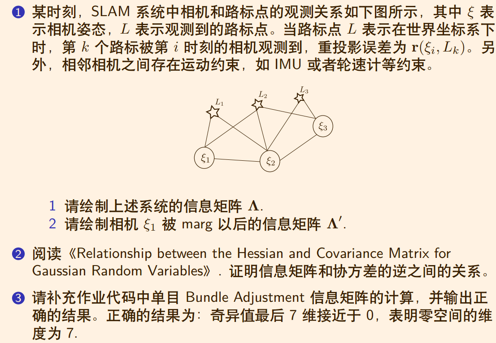
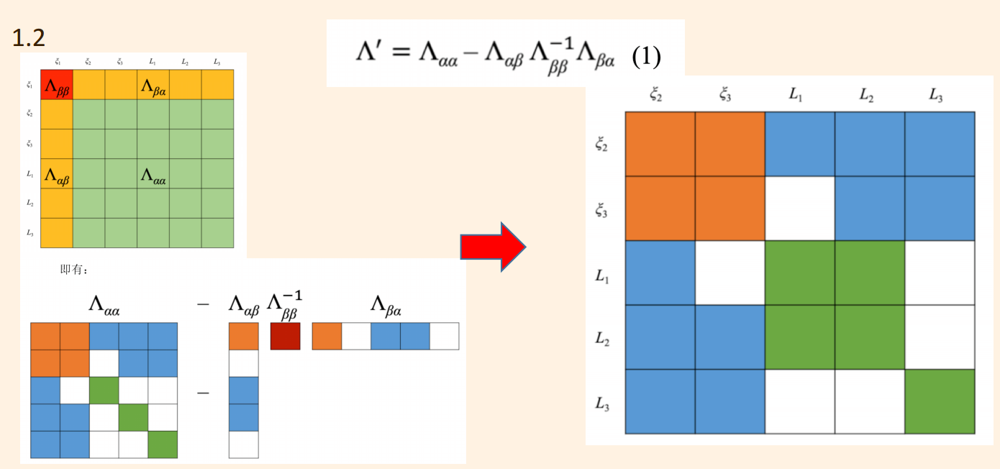
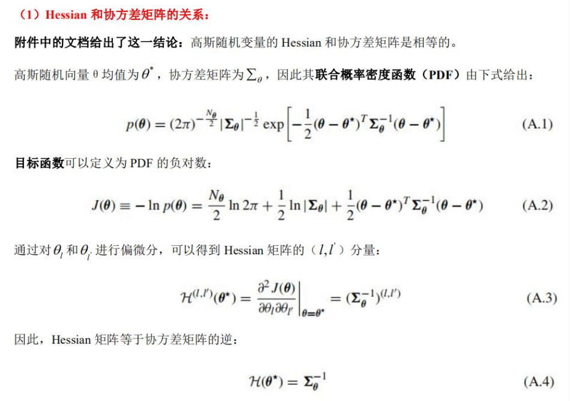
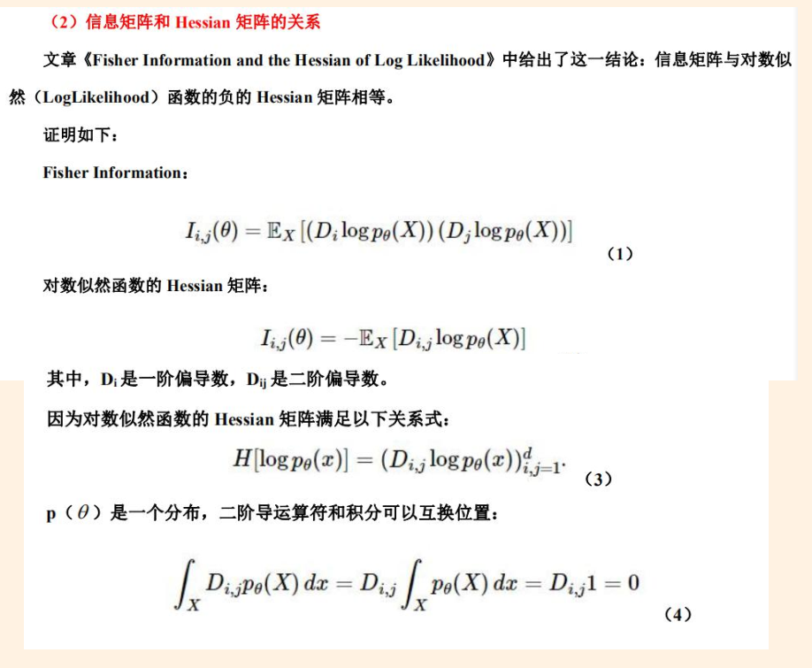
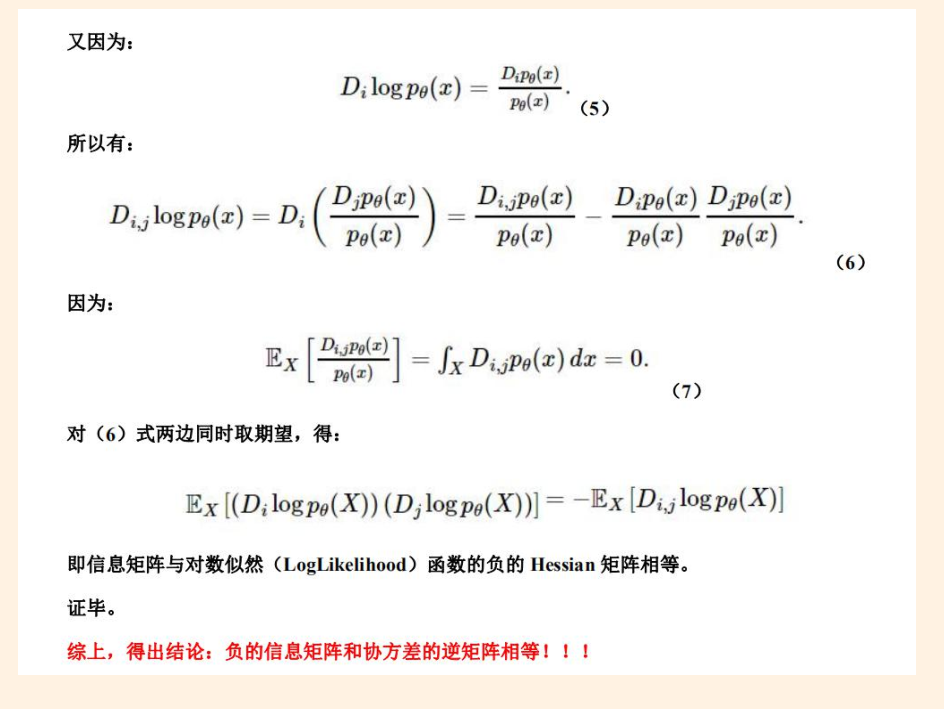

## 作业：



### 1

#### 1.1


#### 1.2



### 2



#### 由上面步骤得出Hessian矩阵和协方差矩阵的关系。





#### 这里证明了信息矩阵和协方差的逆之间的关系。

#### 3 

#### 补充代码块：

```c++
H.block(i*6,i*6,6,6) += jacobian_Ti.transpose() * jacobian_Ti;
/// 请补充完整作业信息矩阵块的计算
H.block(j*3+6*poseNums, j*3+6*poseNums, 3, 3) += jacobian_Pj.transpose() * jacobian_Pj;
H.block(i*6, j*3 + 6*poseNums, 6, 3) += jacobian_Ti.transpose()*jacobian_Pj;
H.block(j*3 + 6*poseNums, i*6, 3, 6) += jacobian_Pj.transpose()*jacobian_T
```

#### 运行结果：

```bash
/home/sjl/GNC/GIT/Shenlan-VIO/ch4/homework/code/nullspace_test/cmake-build-debug/NullSpaceTest
     147.51
    129.146
     108.42
    86.8786
    66.7165
    53.3602
    50.0706
    49.9072
    46.1212
     41.646
    37.4764
    36.9655
    32.5123
    29.4255
    28.6926
    25.7302
    25.2799
    23.9525
    23.4874
    22.1444
    3.75546
    3.63333
    3.59899
    3.48363
    3.44025
    3.26522
     3.2201
    2.97983
    2.74213
    2.53162
   0.420392
   0.394421
   0.349009
   0.304702
   0.284198
   0.269621
   0.261614
   0.253395
   0.250928
   0.247525
   0.233361
    0.20687
   0.195922
   0.185235
   0.182312
   0.180179
    0.17752
   0.174138
    0.16958
   0.168057
   0.163943
   0.161402
   0.158017
   0.154701
   0.152969
   0.146307
   0.145153
   0.144042
   0.141768
   0.135736
   0.131691
   0.126308
   0.122724
   0.122139
   0.120157
   0.119543
   0.116115
  0.0479554
  0.0391613
  0.0382714
  0.0370505
  0.0348714
  0.0338867
  0.0307974
  0.0285107
  0.0273249
  0.0256439
   0.024074
  0.0217149
  0.0189657
  0.0180311
  0.0160844
  0.0156509
  0.0143411
  0.0136067
  0.0133183
  0.0130406
  0.0128135
  0.0125244
  0.0122748
  0.0104077
 0.00982936
 0.00897393
  0.0082873
 0.00763381
 0.00734249
 0.00701361
 0.00634341
 0.00608493
 0.00547299
  0.0053236
 0.00520788
 0.00502341
  0.0048434
 0.00451083
  0.0042627
 0.00386223
 0.00351651
 0.00302963
 0.00253459
 0.00230246
 0.00172459
0.000422374
3.21708e-17
2.06732e-17
1.43188e-17
7.66992e-18
6.08423e-18
6.05715e-18
3.94363e-18

Process finished with exit code 0
```

#### 最后七维接近零，表示零空间的维度为7。