## 作业：

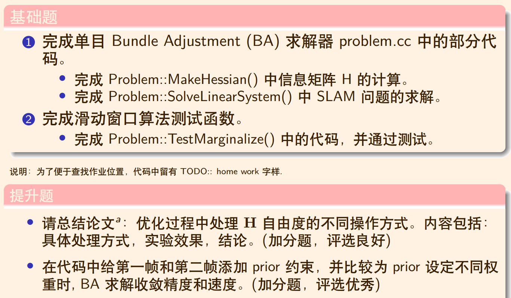

### 基础题：

#### 1

#### 1.1

#### 补充相关的代码块：

```c++
// TODO:: home work.
// 所有的信息矩阵叠加起来
// TODO:: home work，完成H index的填写
H.block(index_i,index_j, dim_i, dim_j).noalias() += hessian;
if (j != i) {
// 对称的下三角
// TODO:: home work, 完成H index的填写
H.block(index_j,index_i,dim_j,dim_i).noalias() += hessian.transpose();
}
```

#### 1.2

#### Problem::SolveLinearSystem()

#### 第一步Schur三角化

$$
\left[\begin{array}{ll}
\mathrm{H}_{\mathrm{pp}} & \mathrm{H}_{\mathrm{pm}} \\
\mathrm{H}_{\mathrm{mp}} & \mathrm{H}_{\mathrm{mm}}
\end{array}\right]\left[\begin{array}{l}
\Delta \mathrm{x}_{\mathrm{p}}^{*} \\
\Delta \mathrm{x}_{\mathrm{m}}^{*}
\end{array}\right]=\left[\begin{array}{c}
\mathrm{b}_{\mathrm{p}} \\
\mathrm{b}_{\mathrm{m}}
\end{array}\right]
$$

```c++
// TODO:: home work. 完成矩阵块取值，Hmm，Hpm，Hmp，bpp，bmm
MatXX Hmm = Hessian_.block(reserve_size,reserve_size, marg_size, marg_size);
MatXX Hpm = Hessian_.block(0,reserve_size, reserve_size, marg_size);
MatXX Hmp = Hessian_.block(reserve_size,0, marg_size, reserve_size);
VecX bpp = b_.segment(0,reserve_size);
VecX bmm = b_.segment(reserve_size,marg_size);
```

$$
两边同时左乘\left[\begin{array}{cc}
\mathrm{I} & -\mathrm{H}_{\mathrm{pm}} \mathrm{H}_{\mathrm{pp}}^{-1} \\
0 & \mathrm{I}
\end{array}\right]
$$

```c++
// TODO:: home work. 完成舒尔补 Hpp, bpp 代码
MatXX tempH = Hpm * Hmm_inv;
H_pp_schur_ = Hessian_.block(0,0,reserve_size,reserve_size) - tempH * Hmp;
b_pp_schur_ = bpp -  tempH * bmm;
```

$$
\left[\begin{array}{cc}
\mathrm{H}_{\mathrm{pp}}-\mathrm{H}_{\mathrm{pm}} \mathrm{H}_{\mathrm{pp}}^{-1} \mathrm{H}_{\mathrm{mp}} & 0 \\
\mathrm{H}_{\mathrm{mp}} & \mathrm{H}_{\mathrm{mm}}
\end{array}\right]\left[\begin{array}{l}
\Delta \mathrm{x}_{\mathrm{p}}^{*} \\
\Delta \mathrm{x}_{\mathrm{m}}^{*}
\end{array}\right]=\left[\begin{array}{c}
\mathrm{b}_{\mathrm{p}}-\mathrm{H}_{\mathrm{pm}} \mathrm{H}_{\mathrm{pp}}^{-1} \mathrm{~b}_{\mathrm{m}} \\
\mathrm{b}_{\mathrm{m}}
\end{array}\right]
$$

#### 第二步 先解

$$
\left(\mathrm{H}_{\mathrm{pp}}-\mathrm{H}_{\mathrm{pm}} \mathrm{H}_{\mathrm{pp}}^{-1} \mathrm{H}_{\mathrm{mp}}\right) \Delta \mathrm{x}_{\mathrm{p}}^{*}=\mathrm{b}_{\mathrm{p}}-\mathrm{H}_{\mathrm{pm}} \mathrm{H}_{\mathrm{pp}}^{-1} \mathrm{~b}_{\mathrm{m}}
$$

```c++
// step2: solve Hpp * delta_x = bpp
VecX delta_x_pp(VecX::Zero(reserve_size));
// PCG Solver
for (ulong i = 0; i < ordering_poses_; ++i) {
       H_pp_schur_(i, i) += currentLambda_;
    }

 int n = H_pp_schur_.rows() * 2;                       // 迭代次数
 delta_x_pp = PCGSolver(H_pp_schur_, b_pp_schur_, n);  // 哈哈，小规模问题，搞 pcg 花里胡哨
 delta_x_.head(reserve_size) = delta_x_pp;
 //        std::cout << delta_x_pp.transpose() << std::endl;
```

#### 第三步 再解

$$
\mathrm{H}_{\mathrm{mm}} \Delta \mathrm{x}_{\mathrm{m}}^{*}=\mathrm{b}_{\mathrm{m}}-\mathrm{H}_{\mathrm{mp}} \Delta \mathrm{x}_{\mathrm{p}}^{*}
$$

```c++
// TODO:: home work. step3: solve landmark
VecX delta_x_ll(marg_size);
delta_x_ll = Hmm_inv*(bmm + Hmp * delta_x_pp);
delta_x_.tail(marg_size) = delta_x_ll;
```

#### TestMonoBA.cpp的第80，81行有如下代码原本注释掉，取消注释表示固定第一帧和第二帧

```c++
if(i < 2)
    vertexCam->SetFixed();
```

#### 取消注释注释，其作用为固定住第1，2帧不对其进行优化，具体操作体现在：

```c++
void Problem::MakeHessian(){
...
if (v_i->IsFixed()) continue;   // Hessian 里不需要添加它的信息，也就是它的雅克比为 0
...
}
```

#### 结果分析：

#### 不固定结果：

```bash
/home/sjl/GNC/GIT/Shenlan-VIO/ch5/homework/code/base/hw_course5_new/cmake-build-debug/app/testMonoBA
0 order: 0
1 order: 6
2 order: 12

 ordered_landmark_vertices_ size : 20
iter: 0 , chi= 5.35099 , Lambda= 0.00597396
iter: 1 , chi= 0.0230034 , Lambda= 0.00199132
iter: 2 , chi= 0.000157611 , Lambda= 0.000663774
iter: 3 , chi= 0.000107757 , Lambda= 0.000442516
problem solve cost: 28.0618 ms
   makeHessian cost: 23.0319 ms

Compare MonoBA results after opt...
after opt, point 0 : gt 0.220938 ,noise 0.227057 ,opt 0.220984
after opt, point 1 : gt 0.234336 ,noise 0.314411 ,opt 0.234792
after opt, point 2 : gt 0.142336 ,noise 0.129703 ,opt 0.142667
after opt, point 3 : gt 0.214315 ,noise 0.278486 ,opt 0.214472
after opt, point 4 : gt 0.130629 ,noise 0.130064 ,opt 0.130558
after opt, point 5 : gt 0.191377 ,noise 0.167501 ,opt 0.19189
after opt, point 6 : gt 0.166836 ,noise 0.165906 ,opt 0.167243
after opt, point 7 : gt 0.201627 ,noise 0.225581 ,opt 0.202171
after opt, point 8 : gt 0.167953 ,noise 0.155846 ,opt 0.168022
after opt, point 9 : gt 0.21891 ,noise 0.209697 ,opt 0.219315
after opt, point 10 : gt 0.205719 ,noise 0.14315 ,opt 0.205969
after opt, point 11 : gt 0.127916 ,noise 0.122109 ,opt 0.127907
after opt, point 12 : gt 0.167904 ,noise 0.143334 ,opt 0.168224
after opt, point 13 : gt 0.216712 ,noise 0.18526 ,opt 0.216855
after opt, point 14 : gt 0.180009 ,noise 0.184249 ,opt 0.180028
after opt, point 15 : gt 0.226935 ,noise 0.245716 ,opt 0.227486
after opt, point 16 : gt 0.157432 ,noise 0.176529 ,opt 0.157583
after opt, point 17 : gt 0.182452 ,noise 0.14729 ,opt 0.182438
after opt, point 18 : gt 0.155701 ,noise 0.182258 ,opt 0.155768
after opt, point 19 : gt 0.14646 ,noise 0.240649 ,opt 0.146689
------------ pose translation ----------------
translation after opt: 0 :-0.000385936   0.00158213   0.00015378 || gt: 0 0 0
translation after opt: 1 : -1.0695  4.00026 0.863927 || gt:  -1.0718        4 0.866025
translation after opt: 2 :-4.00283  6.92625 0.867313 || gt:       -4   6.9282 0.866025
```

#### 优化完成后，第一帧相机的pose平移(x,y,z)不再是原点，说明零空间发生了平移。

#### 固定第一帧和第二帧

```bash
/home/sjl/GNC/GIT/Shenlan-VIO/ch5/homework/code/base/hw_course5_new/cmake-build-debug/app/testMonoBA
0 order: 0
1 order: 6
2 order: 12

 ordered_landmark_vertices_ size : 20
iter: 0 , chi= 5.35099 , Lambda= 0.00597396
iter: 1 , chi= 0.0278735 , Lambda= 0.00199132
iter: 2 , chi= 0.000121311 , Lambda= 0.000663774
problem solve cost: 15.3886 ms
   makeHessian cost: 12.8091 ms

Compare MonoBA results after opt...
after opt, point 0 : gt 0.220938 ,noise 0.227057 ,opt 0.22094
after opt, point 1 : gt 0.234336 ,noise 0.314411 ,opt 0.234283
after opt, point 2 : gt 0.142336 ,noise 0.129703 ,opt 0.142371
after opt, point 3 : gt 0.214315 ,noise 0.278486 ,opt 0.214472
after opt, point 4 : gt 0.130629 ,noise 0.130064 ,opt 0.130547
after opt, point 5 : gt 0.191377 ,noise 0.167501 ,opt 0.191526
after opt, point 6 : gt 0.166836 ,noise 0.165906 ,opt 0.166928
after opt, point 7 : gt 0.201627 ,noise 0.225581 ,opt 0.2019
after opt, point 8 : gt 0.167953 ,noise 0.155846 ,opt 0.167952
after opt, point 9 : gt 0.21891 ,noise 0.209697 ,opt 0.218836
after opt, point 10 : gt 0.205719 ,noise 0.14315 ,opt 0.205588
after opt, point 11 : gt 0.127916 ,noise 0.122109 ,opt 0.127793
after opt, point 12 : gt 0.167904 ,noise 0.143334 ,opt 0.167891
after opt, point 13 : gt 0.216712 ,noise 0.18526 ,opt 0.216895
after opt, point 14 : gt 0.180009 ,noise 0.184249 ,opt 0.179938
after opt, point 15 : gt 0.226935 ,noise 0.245716 ,opt 0.227061
after opt, point 16 : gt 0.157432 ,noise 0.176529 ,opt 0.157537
after opt, point 17 : gt 0.182452 ,noise 0.14729 ,opt 0.182325
after opt, point 18 : gt 0.155701 ,noise 0.182258 ,opt 0.155699
after opt, point 19 : gt 0.14646 ,noise 0.240649 ,opt 0.146548
------------ pose translation ----------------
translation after opt: 0 :0 0 0 || gt: 0 0 0
translation after opt: 1 : -1.0718        4 0.866025 || gt:  -1.0718        4 0.866025
translation after opt: 2 :-3.99917  6.92852 0.859873 || gt:       -4   6.9282 0.866025
```

#### 2 

#### 修改代码块void Problem::TestMarginalize()中的代码:

```c++
// TODO:: home work. 将变量移动到右下角
/// 准备工作： move the marg pose to the Hmm bottown right
// 将 row i 移动矩阵最下面
Eigen::MatrixXd temp_rows = H_marg.block(idx, 0, dim, reserve_size);
Eigen::MatrixXd temp_botRows = H_marg.block(idx + dim, 0, reserve_size - idx - dim, reserve_size);
H_marg.block(idx,0,reserve_size-idx-dim, reserve_size) = temp_botRows;
H_marg.block(reserve_size - dim, 0, dim, reserve_size) = temp_rows;
```

```c++
/// 开始 marg ： schur
double eps = 1e-8;
int m2 = dim;
int n2 = reserve_size - dim;   // 剩余变量的维度
Eigen::MatrixXd Amm = 0.5 * (H_marg.block(n2, n2, m2, m2) + H_marg.block(n2, n2, m2, m2).transpose());

Eigen::SelfAdjointEigenSolver<Eigen::MatrixXd> saes(Amm);
Eigen::MatrixXd Amm_inv = saes.eigenvectors() * Eigen::VectorXd((saes.eigenvalues().array() > eps).select(saes.eigenvalues().array().inverse(), 0)).asDiagonal() *
                              saes.eigenvectors().transpose();

// TODO:: home work. 完成舒尔补操作
Eigen::MatrixXd Arm = H_marg.block(0,n2,n2,m2);
Eigen::MatrixXd Amr = H_marg.block(n2,0,m2,n2);
Eigen::MatrixXd Arr = H_marg.block(0,0,n2,n2);

Eigen::MatrixXd tempB = Arm * Amm_inv;
Eigen::MatrixXd H_prior = Arr - tempB * Amr;

std::cout << "---------- TEST Marg: after marg------------"<< std::endl;
std::cout << H_prior << std::endl;
```

#### 运行结果：

```bash
---------- TEST Marg: before marg------------
     100     -100        0
    -100  136.111 -11.1111
       0 -11.1111  11.1111
---------- TEST Marg: 将变量移动到右下角------------
     100        0     -100
       0  11.1111 -11.1111
    -100 -11.1111  136.111
---------- TEST Marg: after marg------------
 26.5306 -8.16327
-8.16327  10.2041

Process finished with exit code 0
```

#### 在marg变量v2以前，变量v1和变量v3信息矩阵对应的位置为0，v1和v3关于v2条件独立。将

#### v2移动到右下角并marg以后，信息矩阵对应位置为0，v1和v3产生了联系。

### 3

####        讨论使用最小二乘法解决VIO问题时处理不可观自由度（Gauge Freedom）的三种处理方法和性能对比。

#### 需要关注的问题：

:o:三种方法的具体处理方式

:o:性能对比

#### global position和global yaw不可观的后果

#### 对于代价函数

$$
J(\boldsymbol{\theta}) \doteq \underbrace{\left\|\mathbf{r}^{V}(\boldsymbol{\theta})\right\|_{\Sigma_{V}}^{2}}_{\text {Visual }}+\underbrace{\left\|\mathbf{r}^{I}(\boldsymbol{\theta})\right\|_{\Sigma_{I}}^{2}}_{\text {Inertial }}
$$

$$
J(\boldsymbol{\theta})=J(g(\boldsymbol{\theta}))其中g \doteq\left(\begin{array}{cc}
\mathrm{R}_{z} & \mathbf{t} \\
0 & 1
\end{array}\right)，且g(\boldsymbol{\theta})=\boldsymbol{\theta}^{\prime} \equiv\left\{\mathbf{p}_{i}^{\prime}, \mathrm{R}_{i}^{\prime}, \mathbf{v}_{i}^{\prime}, \mathbf{X}_{j}^{\prime}\right\}
$$

$$
\begin{array}{ll}
\mathbf{p}_{i}^{\prime}=\mathrm{R}_{z} \mathbf{p}_{i}+\mathbf{t} & \mathrm{R}_{i}^{\prime}=\mathrm{R}_{z} \mathrm{R}_{i} \\
\mathbf{v}_{i}^{\prime}=\mathrm{R}_{z} \mathbf{v}_{i} & \mathbf{X}_{j}^{\prime}=\mathrm{R}_{z} \mathbf{X}_{j}+\mathbf{t}
\end{array}
$$

$$
最优解\boldsymbol{\theta}^{*}，任意对全局z轴的旋转变换和全局平移都不会改变代价函数的大小，即存在多个最优解。
$$

$$
\mathcal{M}_{\boldsymbol{\theta}} \doteq\{g(\boldsymbol{\theta}) \mid g \in \mathcal{G}\}
$$

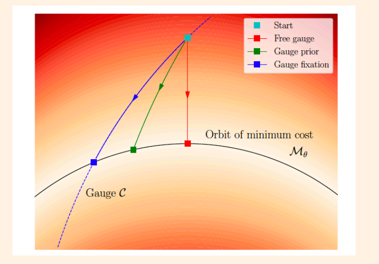
$$
这些最优解可以组成一个具有4自由度的流形\mathcal{M}_{\boldsymbol{\theta}} \doteq\{g(\boldsymbol{\theta}) \mid g \in \mathcal{G}\}
$$

#### 处理gauge freedom的3种方法：

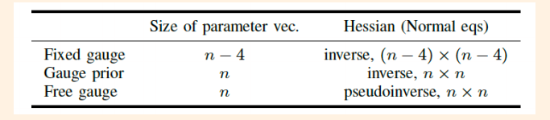

#### :o:Fixed Gauge:

#### 固定第一帧的global position和global yaw。相当于引入新的测量信息，使原本不可观的状态变得可观。信息矩阵H满秩，可求逆得到唯一最优解。

#### :o:Free Gauge:

#### 不处理不可观的状态，得到的解会在零空间漂移。信息矩阵H不满秩，可用Moore-Penrose广义逆求解得到范数最小的最小二乘解。

#### :o:Gauge Prior:

####  介于上面两个方法之间，改变残差权重，添加额外信息以处理不可观状态。信息矩阵满秩，通过求逆可以得到唯一最优解。

#### 三种方法的图像化对比：

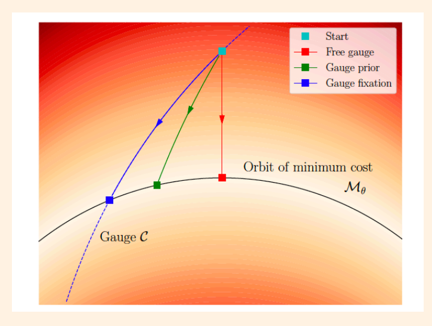

#### :o:Fixed Gauge:

#### 将解限定在某一个流形上，最优解：

$$
\boldsymbol{\theta}_{C}=\mathcal{C} \cap \mathcal{M}_{\boldsymbol{\theta}}
$$

#### :o:Free Gauge:

#### 获得最小范数的最小二乘解，垂线段最短。

#### :o:Prior Gauge:

#### 介于两者之间。

#### Gauge Fixation和Gauge Prior的处理方法

$$
（1）使用LM算法得到增量\delta \phi^{q}，那么第Q次迭代后的旋转量为：
$$

$$
\mathrm{R}^{Q}=\prod_{q=0}^{Q-1} \operatorname{Exp}\left(\delta \phi^{q}\right) \mathrm{R}^{0}
$$

$$
（2）即使限制\delta \phi^{q}的z轴分量为0，每一次迭代都会在上一次的基础上改变roll和pitch，使得这一帧的z轴和最
$$

初z轴不重合，总体来看还是改变了yaw。

（3）为了更好限制初始帧的yaw，对初始帧的位姿更新都是对0时刻的更新。

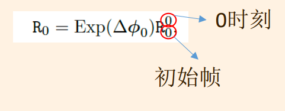

####  Gauge Fixation:

#### 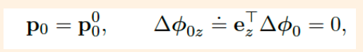等价于对应Jacobian置零。

#### Gauge Prior:

#### 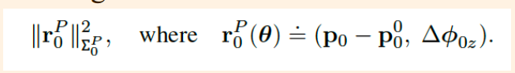增加惩罚项，信息矩阵设置权重。

#### 性能对比：

#### （1）SE3对齐第一帧，用旋转向量的角度差和平移向量的二范数的RMSE评价。

#### （2）性能：精度，适宜的权重，迭代次数与时间，协方差。

#### 协方差也需要像评价旋转和平移一样对齐

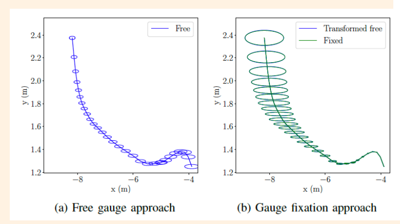

#### :o:Gauge Fixation:不确定性不断增长

#### :o:Free Gauge:将不确定性“平摊”到每一帧

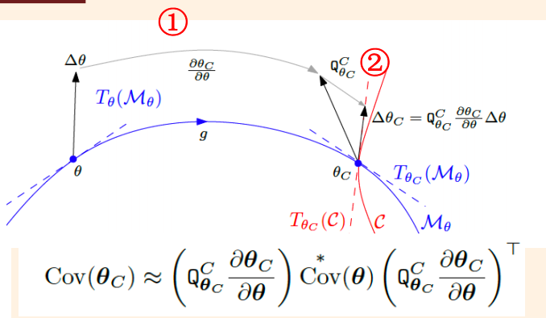

#### :o:协方差变换后才能对比：

$$
1）将\theta \text { 沿 } \mathcal{M}_{\theta} \text { 对齐到 } \theta_{C}, \Delta \theta \text { 变换成 } \Delta \theta_{C}
$$

$$
2）取 \Delta \theta_{C} 沿流形C在 \theta_{C} 切空间 T_{\theta_{C}}(\mathcal{C}) 的
分量
$$

### 4

#### 在代码中给第一帧和第二帧添加prior约束，并比较为prior设定不同权重时，BA求解收敛精度

#### 和速度。

#### 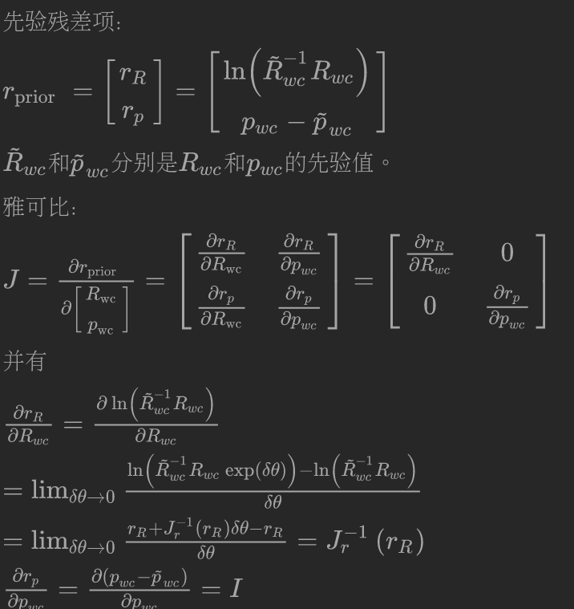 

#### 参数设置：

```c++
int featureNums = 50;  // 特征数目，假设每帧都能观测到所有的特征
int poseNums = 7;     // 相机数目
```

#### 调整观测噪声：

```c++
std::normal_distribution<double> noise_pdf(0., 3. / 1000.);  // 2pixel / focal
```


#### 结果分析：

#### （1）迭代次数和权重的关系：

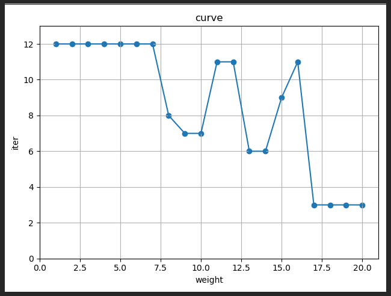

#### 随着权重值的增加，迭代次数逐渐减小。

#### （2）solve时间和权重的关系：

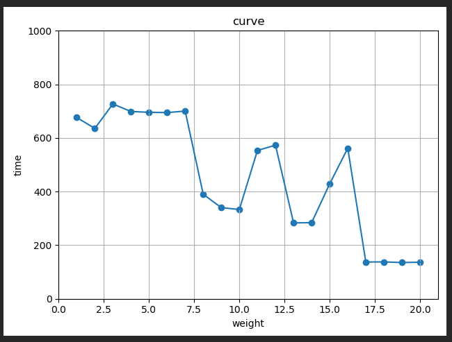

#### 随着权重值增加，解算时间也在减小。

#### （3）landmark RMSE和权重的关系：

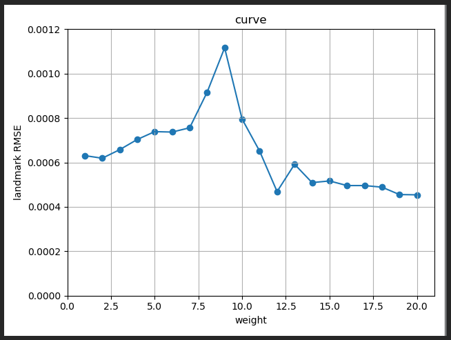

#### 随着权重值增加，landmark的RMSE也在减小。

#### （4）cam pose rot RMSE和权重关系：

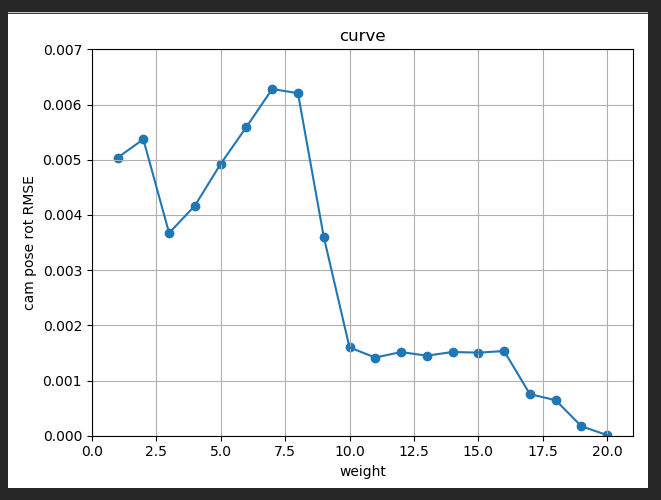

#### 结果同上。

#### （5）cam pose tran RMSE和权重关系：

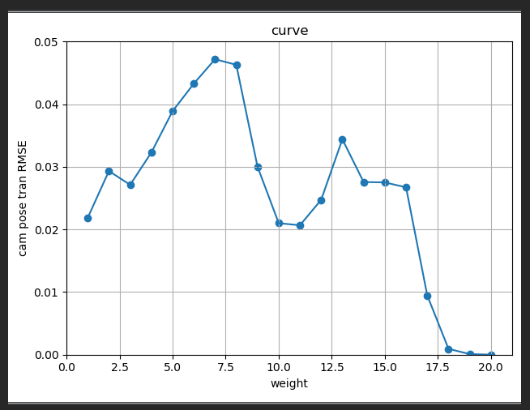

#### 结果同上。