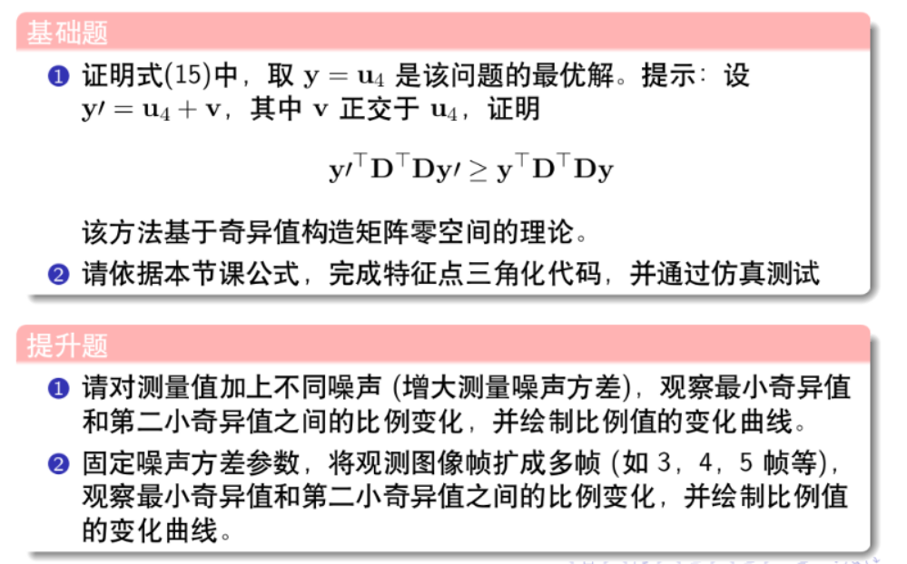
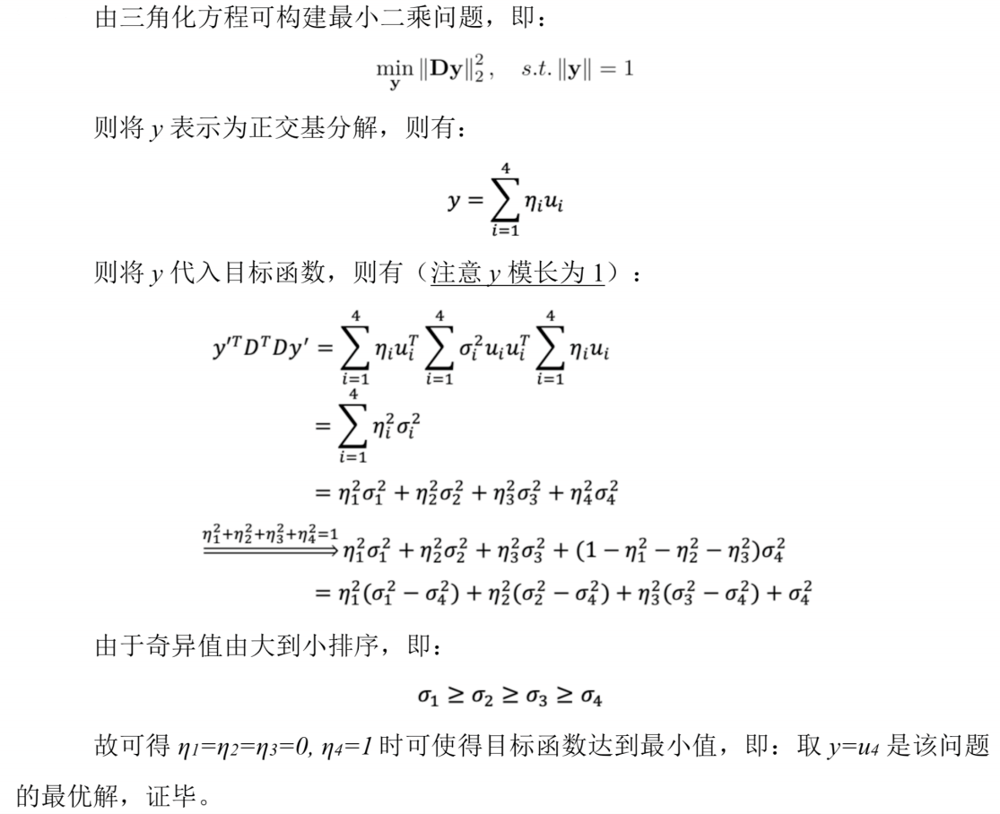
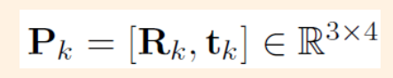
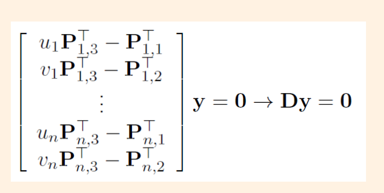
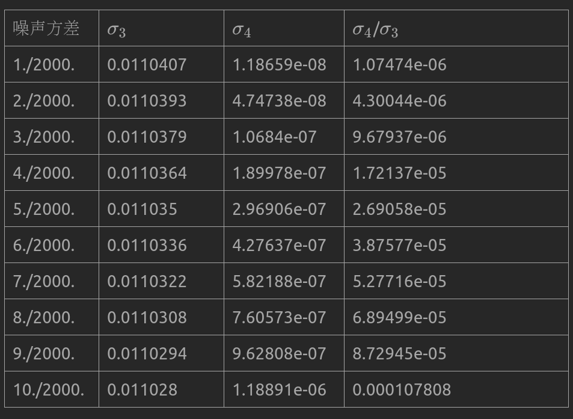
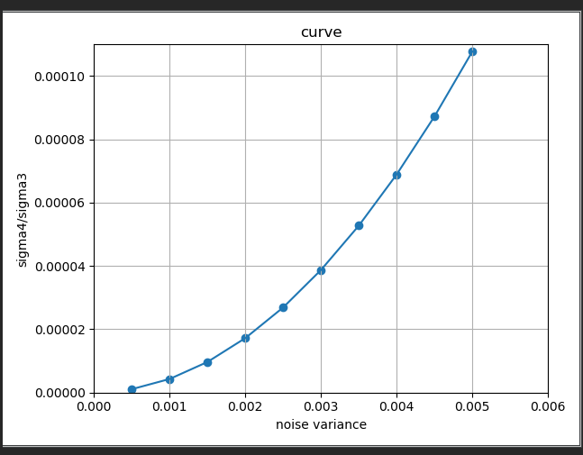
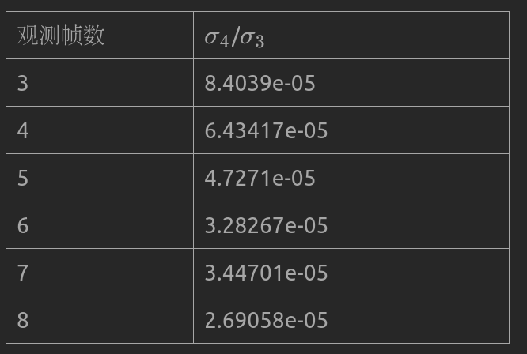
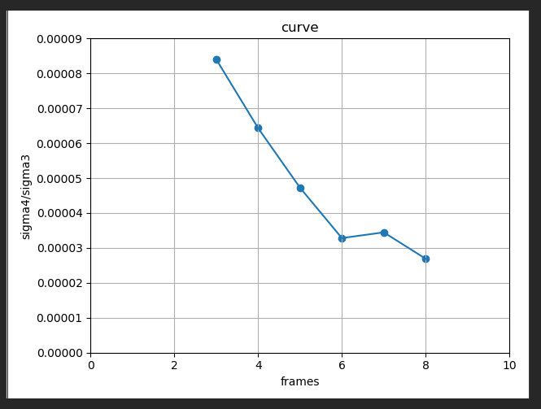

## 作业：



### 基础题：

### 1



### 2

#### 完善三角化代码：



#### 

#### （1）根据左式拼接D矩阵。

#### （2）作奇异值分解（Eigen中的函数）。

#### 运行结果：

```bash
/home/sjl/GNC/GIT/Shenlan-VIO/ch6/homework/code/cmake-build-debug/estimate_depth
D Matrix is :
-0.707107 -0.707107  -1.20623   3.54938
 0.707107 -0.707107 -0.901552   6.55841
-0.587785 -0.809017   -1.3387   4.57089
 0.809017 -0.587785 -0.931522   7.35807
 -0.45399 -0.891007  -1.44771    5.5393
 0.891007  -0.45399 -0.922158   7.87409
-0.309017 -0.951057  -1.53002   6.42719
 0.951057 -0.309017 -0.878674   8.12492
-0.156434 -0.987688  -1.58784   7.23919
 0.987688 -0.156434 -0.809719   8.15172
Max = 
8.15172行：9列：3
singularValues: 
1.06204e-14
ground truth: 
-3.47385  -2.1654  6.24833
your result: 
-3.47385  -2.1654  6.24833

Process finished with exit code 0
```

#### 分析：

#### 可以看出在不加噪声的情况下，三角化估计得到的特征点和实际的特征点在世界坐标系下的坐标一致。

### 提升题：

#### 1



#### 噪声方差对应1到10个像素误差。曲线图如下：



#### 随着方差增大，sigma4/sigma3也在不断增大，三角化误差不断增大。

### 2

### 噪声参数设定为5个像素误差。



#### 曲线图如下：



#### 可见随着观测帧数增加，sigma4/sigma3呈现减小趋势，三角化精度提高。