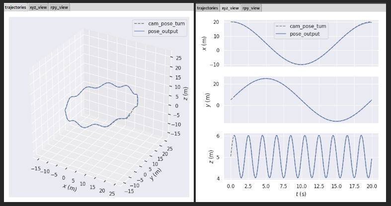
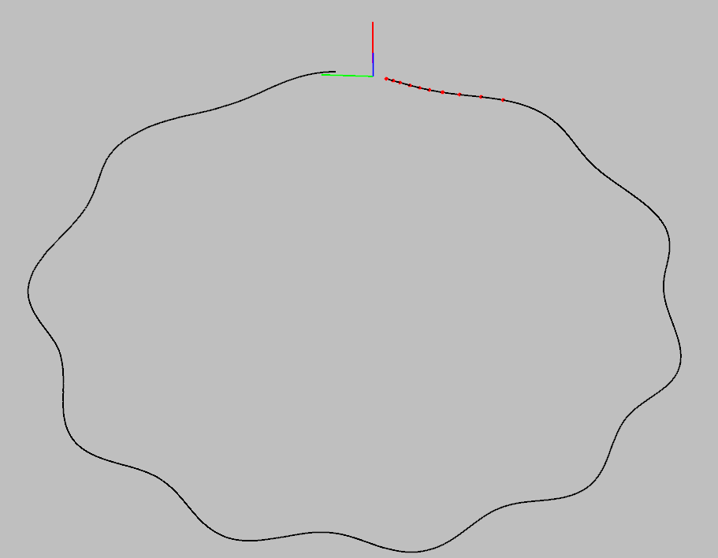
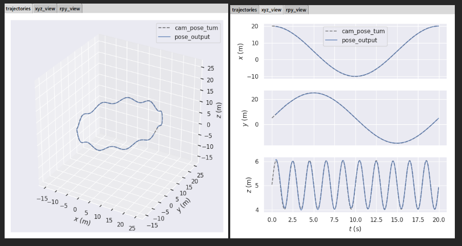
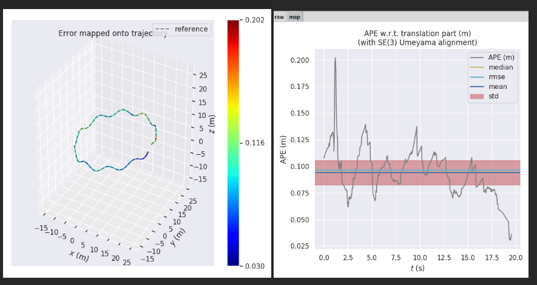
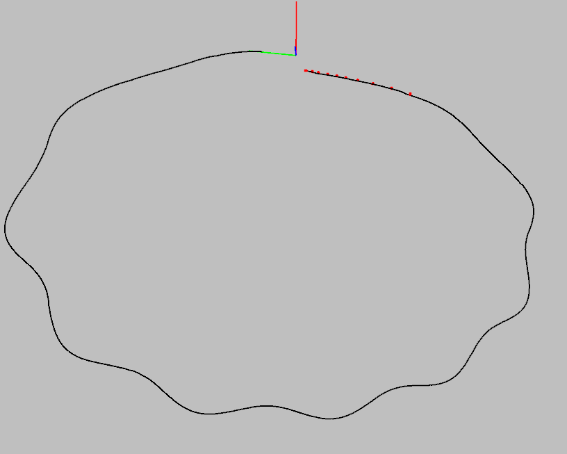
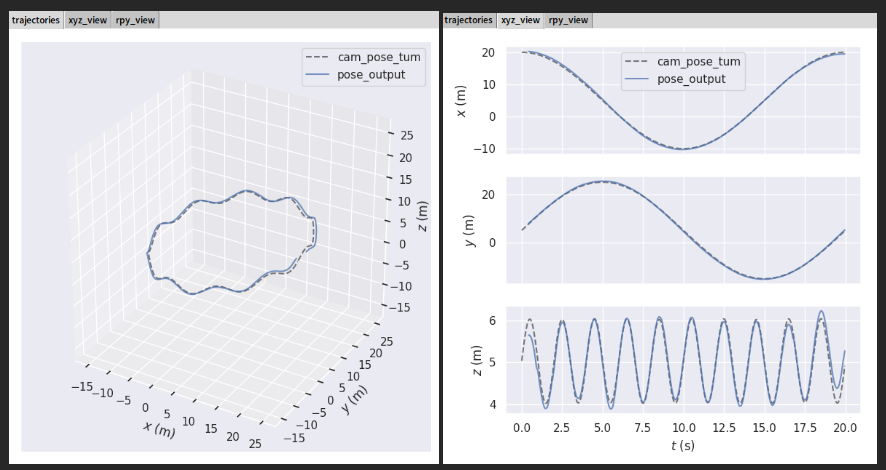
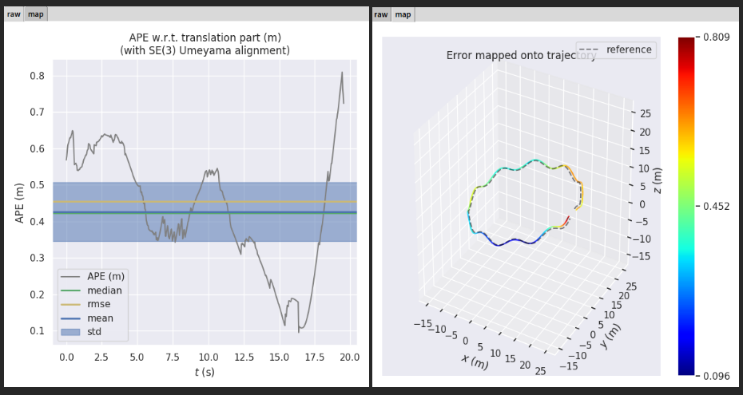

## 作业：


### 将第二讲的仿真数据集（视觉特征，IMU数据）接入我们的VINS代码，并运行出轨迹结果。

- ### 仿真数据集无噪声

- #### 仿真数据集有噪声（不同噪声设定时，需要配置vins中imu noise大小）

  

####        上图可以知道，imu_pose_noise.txt表示包含噪声的IMU位姿，imu_pose.txt表示不包含

#### 噪声的IMU位姿。cam_pose.txt表示所有相机位姿，imu_init_pose.txt表示积分后的imu轨

#### 迹，imu_init_pose_noise.txt表示带噪声的积分后的IMU轨迹。（本文采用中值积分）。

#### yaml配置文件关键部分：

```yaml
#camera calibration 
model_type: PINHOLE
camera_name: camera
image_width: 640
image_height: 640
distortion_parameters:
   k1: 0
   k2: 0
   p1: 0
   p2: 0
projection_parameters:
   fx: 460
   fy: 460
   cx: 255
   cy: 255                        
extrinsicRotation: 
   rows: 3
   cols: 3
   dt: d
   data: [0, 0, -1,
           -1, 0, 0,
           0, 1, 0]
extrinsicTranslation: 
   rows: 3
   cols: 1
   dt: d
   data: [0.05, 0.04, 0.03]  
```

#### 1，仿真数据集无噪声

#### 这里没有噪声指的是第二讲生成的数据集不包含噪声，并且vins的config的yaml文件中不加入

#### imu noise。

```yaml
double gyro_bias_sigma = 0.0;
double acc_bias_sigma = 0.0;

double gyro_noise_sigma = 0.0;    
double acc_noise_sigma = 0.0;      
double pixel_noise = 0.0; 
```

euroc_config.yaml

```yaml
acc_n: 0.0          
gyr_n: 0.0         
acc_w: 0.0         
gyr_w: 0.0       
g_norm: 9.81007 
```

#### IMU积分方式都采用中值积分：

#### 无噪声结果：


#### 运行指令1：

```bash
evo_traj tum -a pose_output.txt --ref=cam_pose_tum.txt -p --plot_mode=xyz 
```

由于需要初始化，最初一段时间并没有算。



### 运行指令2:

```bash
 evo_ape tum cam_pose_tum.txt pose_output.txt -va --plot --plot_mode xyz   
Aligning using Umeyama's method...
Rotation of alignment:
[[ 9.99219322e-01 -3.95058769e-02  1.76864910e-04]
 [ 3.95058440e-02  9.99219322e-01  1.85884076e-04]
 [-1.84070349e-04 -1.78751763e-04  9.99999967e-01]]
Translation of alignment:
[20.17470545  5.75310234  5.34342814]
Scale correction: 1.0
--------------------------------------------------------------------------------
Compared 587 absolute pose pairs.
Calculating APE for translation part pose relation...
--------------------------------------------------------------------------------
APE w.r.t. translation part (m)
(with SE(3) Umeyama alignment)

       max    0.444962
      mean    0.125079
    median    0.107359
       min    0.044050
      rmse    0.152333：
       sse    13.621481
       std    0.086952

--------------------------------------------------------------------------------
Plotting results... 
```


### 2，仿真数据集有噪声情况1：

#### 这里设置噪声指的是第二讲生成的数据集包含噪声，并且vins的config的yaml文件中加入imu noise。

```yaml
double gyro_bias_sigma = 1.0e-6;
double acc_bias_sigma = 0.00001;

double gyro_noise_sigma = 0.0015;   
double acc_noise_sigma = 0.0019;      
double pixel_noise = 1;   
```

#### euroc_config.yaml

```yaml
acc_n: 0.08          
gyr_n: 0.004         
acc_w: 0.00004         
gyr_w: 2.0e-6       
g_norm: 9.81007  
```

IMU积分方式都采用中值积分

有噪声结果：



#### 运行指令1:

```bash
evo_traj tum -a pose_output.txt --ref=cam_pose_tum.txt -p --plot_mode=xyz
```



#### 运行指令2：

```bash
$ evo_ape tum cam_pose_tum.txt pose_output.txt -va --plot --plot_mode xyz   
Aligning using Umeyama's method...
Rotation of alignment:
[[ 0.99951508 -0.03104705  0.00238613]
 [ 0.03105111  0.99951638 -0.00168434]
 [-0.00233268  0.00175762  0.99999573]]
Translation of alignment:
[19.94806837  5.63129548  5.37308238]
Scale correction: 1.0
--------------------------------------------------------------------------------
Compared 587 absolute pose pairs.
Calculating APE for translation part pose relation...
--------------------------------------------------------------------------------
APE w.r.t. translation part (m)
(with SE(3) Umeyama alignment)

       max    0.202114
      mean    0.094200
    median    0.094836
       min    0.030417
      rmse    0.096929
       sse    5.514958
       std    0.022838

--------------------------------------------------------------------------------
Plotting results... 
```



#### 精度比无噪声精度还高。

### 3，仿真数据集有噪声情况2

这里设置噪声指的是第二讲生成的数据集包含噪声，并且vins的config的yaml文件中加入imu noise。

```yaml
double gyro_bias_sigma = 5.0e-6;
double acc_bias_sigma = 0.00005;

double gyro_noise_sigma = 0.0075;    
double acc_noise_sigma = 0.0090;      

double pixel_noise = 5;    
```

euroc_config.yaml

```yaml
acc_n: 0.40          
gyr_n: 0.020        
acc_w: 0.00020         
gyr_w: 1.0e-5       
g_norm: 9.81007   
```

IMU积分方式都采用中值积分

有噪声结果：



#### 运行指令1：

```bash
$ evo_traj tum -a pose_output.txt --ref=cam_pose_tum.txt -p --plot_mode=xyz 
```



#### 运行指令2:

```bash
evo_ape tum cam_pose_tum.txt pose_output.txt -va --plot --plot_mode xyz   
Aligning using Umeyama's method...
Rotation of alignment:
[[ 0.99983282 -0.01372515  0.01208076]
 [ 0.01384088  0.99985862 -0.00954874]
 [-0.01194799  0.00971435  0.99988143]]
Translation of alignment:
[20.39603881  5.8581174   4.97242628]
Scale correction: 1.0
--------------------------------------------------------------------------------
Compared 587 absolute pose pairs.
Calculating APE for translation part pose relation...
--------------------------------------------------------------------------------
APE w.r.t. translation part (m)
(with SE(3) Umeyama alignment)

       max    0.809056
      mean    0.426745
    median    0.422855
       min    0.095722
      rmse    0.455849
       sse    121.977851
       std    0.160273

--------------------------------------------------------------------------------
Plotting results... 

```



#### 可以看出误差显著增大。