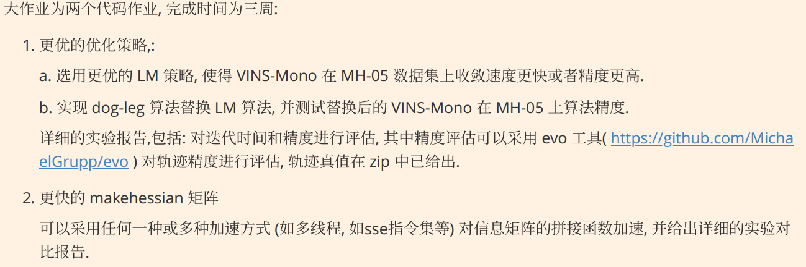
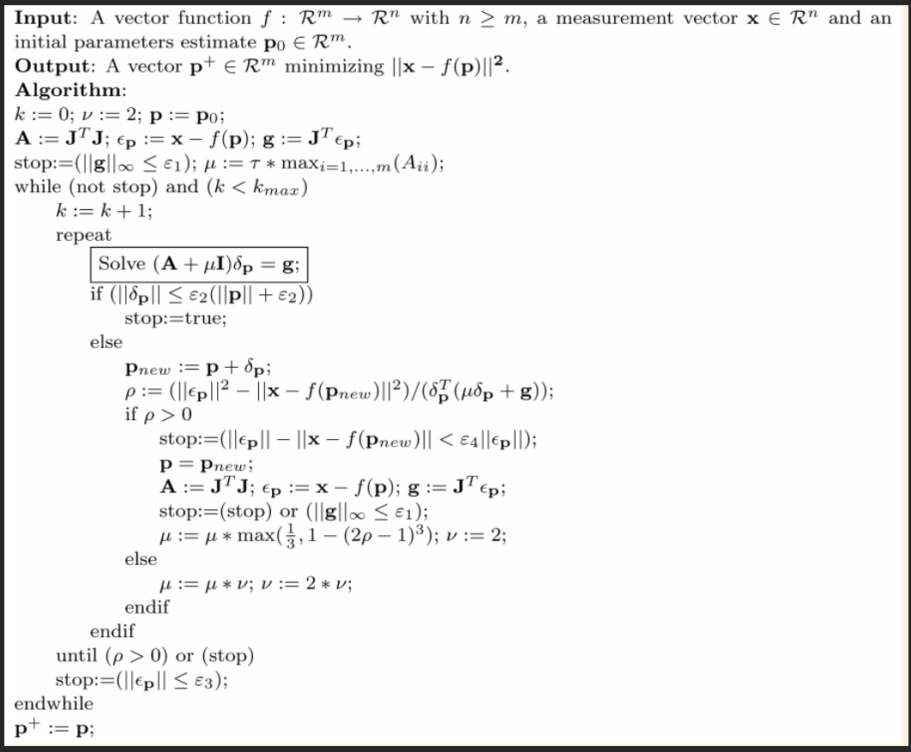
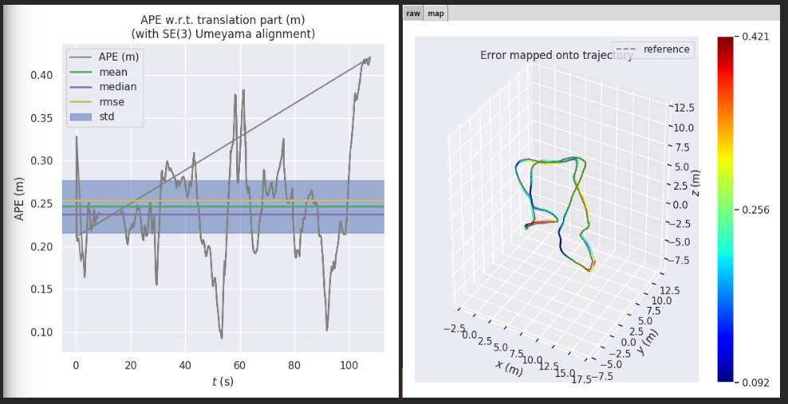
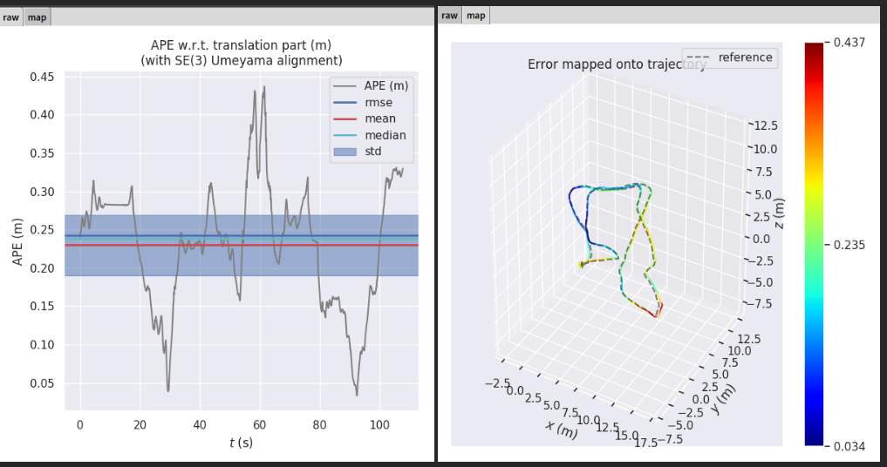
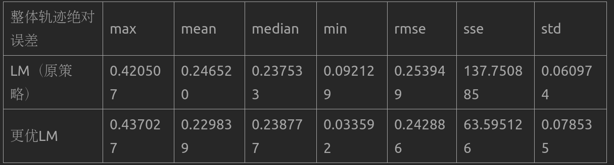
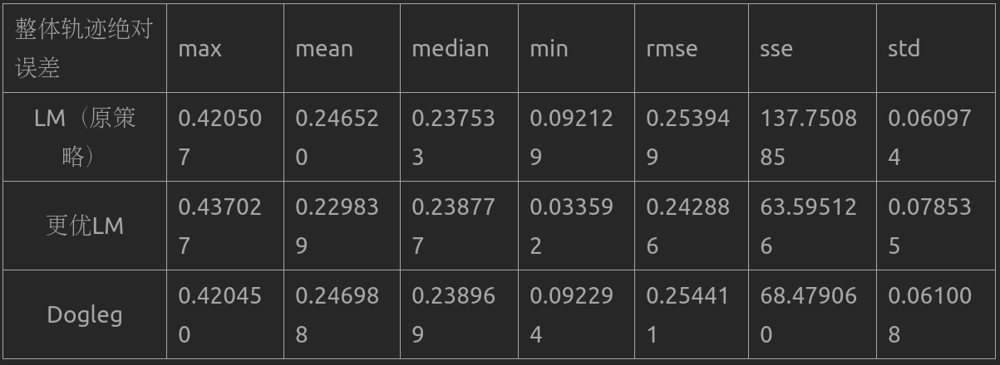
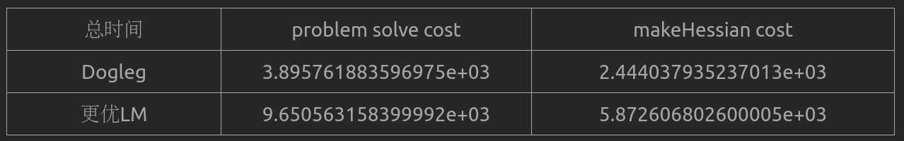
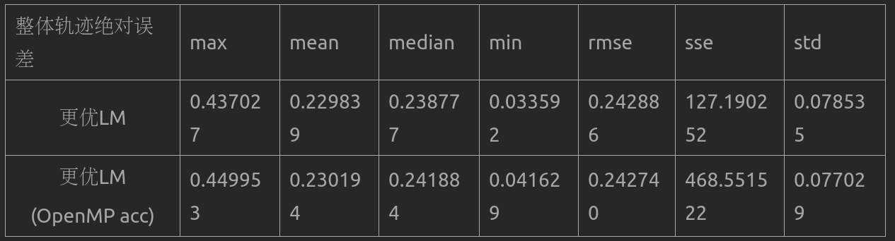
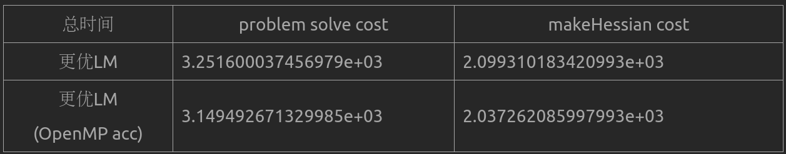
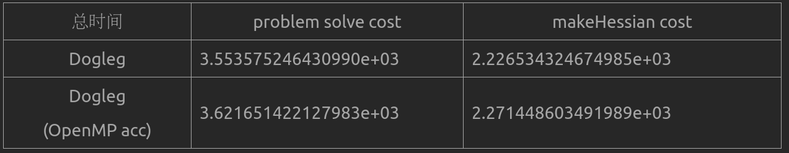

## 作业：



#### 1,更优的优化策略：

#### a.选用更优的LM策略，使得VINS-Mono在MH-05数据集上收敛更快或者精度更高。

#### b.实现dog-leg算法替换LM算法，并测试替换后的VINS-Mono在MH-05上算法精度。

#### 详细的实验报告，包括：对迭代时间和精度进行评估，其中精度评估可以采用evo工具对轨迹

#### 精度进行评估，轨迹真实值在zip中已给出。

#### a.

#### LM算法主要分为三步：

#### （1）初始化LM参数

#### （2）normal equation求解

#### （3）更新阻尼因子

#### g2o或ceres采用如下的求解方式：



#### 改进方法：

#### 滑动优化的过程中，特别是滑动窗中关键帧数量稳定时，margin掉一帧和新增一帧，优化问

#### 题的结构不会产生很大的变化，因此上次优化结果可以利用起来用于下一次优化。

#### 代码修改策略：

#### 代码中记录优化中最后一次good step的lambda值和chi值。

#### 新的优化问题，若初始chi值比记录的上次优化结果chi值小，说明上一次结果也是当前问题的

#### 初始线性化点很好的初值，此时取上一次优化结果的lambda值的一半作为当前优化问题的初

#### 始lambda值，使其更接近高斯牛顿法。

#### 若新的优化问题chi值更大，说明初始值策略差，取记录的lambda值的两倍作为新问题初始

#### lambda值，使更接近最速下降法。

#### 使用evo工具对于精度进行评估：

```bash
evo_ape tum euroc_mh05_groundtruth.txt pose_output_new.txt -va --align --plot --plot_mode xyz --save_results MH_05_sequence
```

#### 原策略：



#### 更优LM：





#### 结果分析：

#### 从上表可以分析得出，采用更优的LM策略精度有所提升。

#### b.

#### 改用Dogleg算法：

#### 该算法将GaussNewton以及最速下降法混合。主要参考下面链接：

#### [Dogleg](https://blog.csdn.net/stihy/article/details/52737723)



单位：s



#### Dogleg收敛速度更快，收敛精度没有太大提升。

#### 2,更快的makehessian矩阵

####         可以采用任何一种或多种加速方式（如多线程，如sse指令集等）对信息矩阵的拼接函

#### 数加速，并给出详细的实验对比报告。

#### 更优LM

#### 收敛精度：



#### 收敛速度：

#### 通过生成costTime.txt，分别计算problem solve cost和makeHessian cost的总和。

#### 单位：s



#### 可以看出使用OpenMP acc加速方式可以提高收敛速度，但是收敛精度降低。

#### Dogleg

#### 收敛精度：

#### 收敛速度：

#### 单位：s



#### 对于Dogleg来说，使用OpenMP acc加速方式并没有使收敛精度和速度发生太大变化。